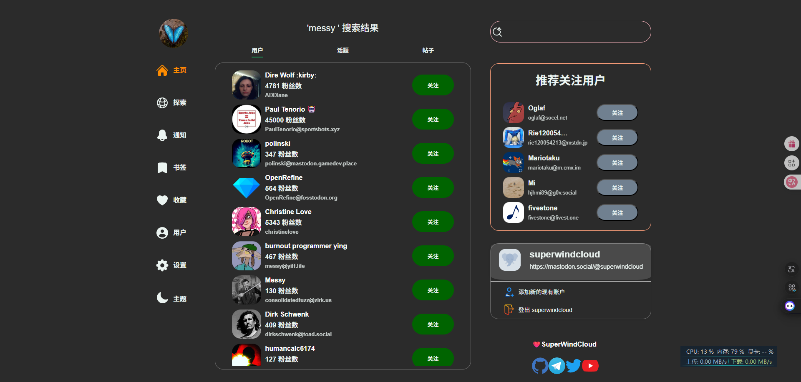
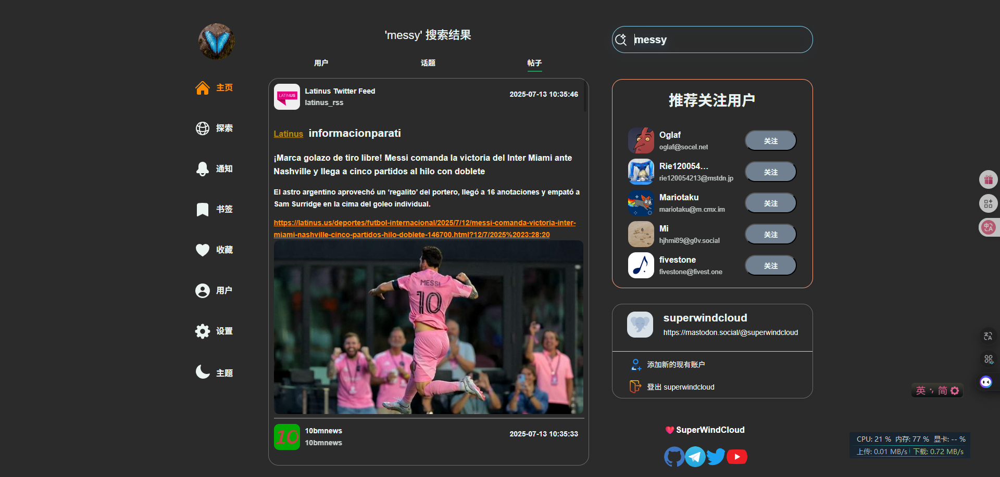

# 基于ActivityPub协议的 兼容Mastodon实例的社交微博网站

> [!IMPORTANT]
> 正在开发中...

## 截图


---

---

## Features

- [x] 登录, 注册Mastodon实例节点
- [x] 暗色模式,浅色模式, 主题切换
- [x] 兼容Firefox, Chrome, Safari, Edge, Opera 
- [x] 搜索功能 ,用户详情页, 帖子详情页, 话题详情页
- [x] 打包到PC端
---

## 启动Web

```bash
pnpm  install 
pnpm  dev
```
`访问 http://localhost:3333/`

## 启动PC
```bash
pnpm  generate
pnpm  td
```
